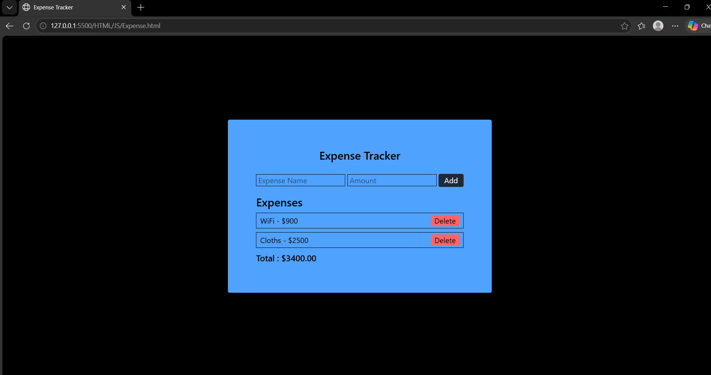

# Expense Tracker

A simple expense tracking web application to record purchases and calculate total spending.

## Features

- Add products and their prices
- Display individual purchases
- Delete expenses
- Calculate total amount spent

## Technologies Used

- HTML5
- CSS3
- JavaScript

## How to Run

1. Clone this repository.
2. Open the index.html file in your web browser.
3. Enter a product name and its price.
4. Add the expense to the list.
5. View the total amount spent.

## Project Preview

